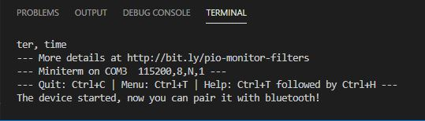
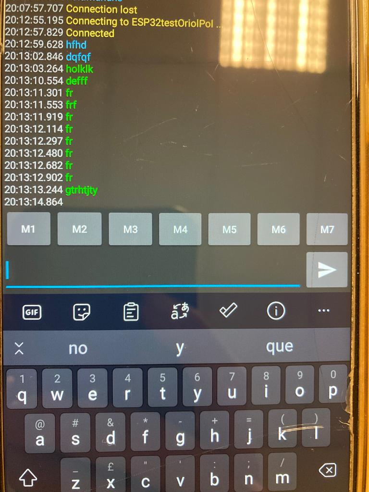

# PRACTICA 2 : WIFI y BLUETOOTH
## Practica B comunicación bluetooth con el movil
### CÓDIGO:
```cpp

#include "BluetoothSerial.h"
#if !defined(CONFIG_BT_ENABLED) || !defined(CONFIG_BLUEDROID_ENABLED)
#error Bluetooth is not enabled! Please run `make menuconfig` to and enable it
#endif
BluetoothSerial SerialBT;
void setup() {
Serial.begin(115200);
SerialBT.begin("ESP32testOriolPol"); //Bluetooth device name
Serial.println("The device started, now you can pair it with bluetooth!");
}
void loop() {
if (Serial.available()) {
SerialBT.write(Serial.read());
}
if (SerialBT.available()) {
Serial.write(SerialBT.read());
}
delay(20);
}

```

### FUNCIONAMIENTO:

Para este programa, vamos a realizar una comunicación mediante bluetooth.
El dispositivo blotooth del esp32 (slave) va a recibir texto desde un telefono i con el codigo implementado conseguimos establecer la conexion con el telefono 

ejecutando el progrmana podemos ver este mennsaje por el puerto serie:


Para escribir i enviar al informacion desde el telefono usaremos la aplicacion serial bluetooth terminal

Una vez en la aplicación y ejecutado el programa, buscamos nuestra ESP32, en nustro caso le cambiamos el nombre a 'ESP32testOriolPol', cuando ya se haya realizado la conexió, se puede escribir des del teléfono y se mustra en el monitor y al revés.


